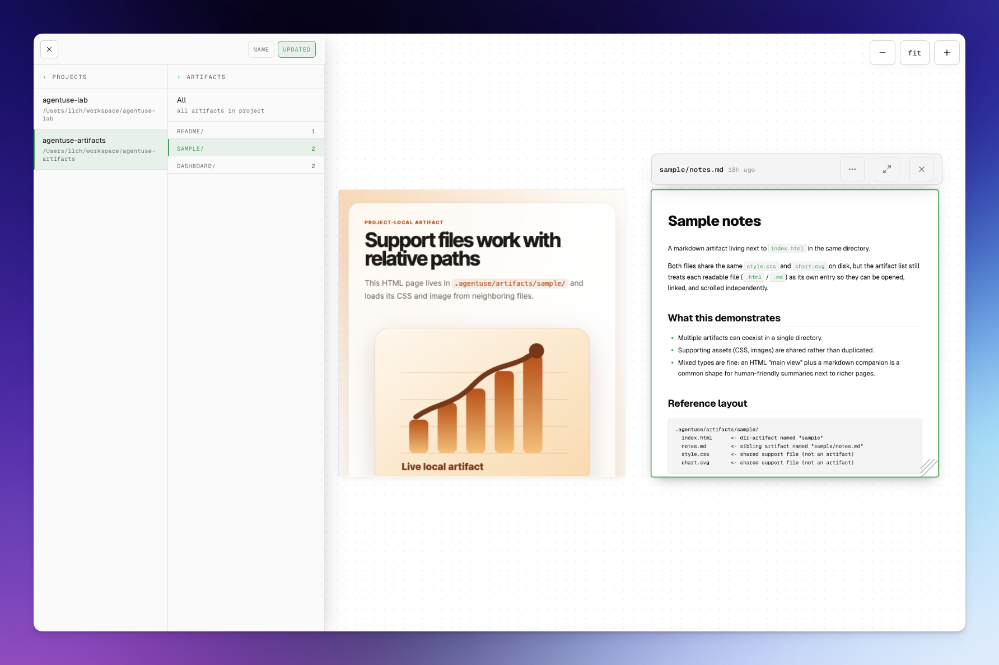

<h1 align="center">@agentuse/artifacts</h1>

<p align="center">
  <strong>A local-first viewer for AI agent output.</strong><br/>
  Drop the Skill into Claude Code and your agents start saving every report, plan, and dashboard into a real, browsable artifact gallery on your machine.
</p>

<p align="center">
  <a href="https://www.npmjs.com/package/@agentuse/artifacts"></a>
  <a href="https://nodejs.org"></a>
  <a href="LICENSE"></a>
</p>

<p align="center">
  
</p>

---

Agents are great at producing things: plans, reports, dashboards, scratchpads, designs. They are bad at giving you a place to read them. The interesting deliverable usually ends up buried in a transcript, overwritten by the next run, or saved to a random path nobody ever opens.

I kept hitting the same wall: the agent would finish a task, drop a file somewhere, and I'd have no idea where. I'd scroll back through the transcript looking for the path, copy it into Finder or `cat`, realize it was an HTML file that needed a browser, open it manually, then do the same dance for the next artifact ten minutes later. Half the value of what the agent produced was lost to friction. I built this so the answer to "where did it go?" is always the same: it's in the viewer, alongside everything else the agent has ever made.

`@agentuse/artifacts` is a tiny piece of plumbing for that gap. It ships as:

1. **A Claude Code Skill** that teaches the agent where to save artifacts and how to lay them out.
2. **A local web viewer** that auto-discovers those artifacts across all your projects and renders them, including sandboxed HTML. The viewer lays each project out as a pannable, zoomable canvas so you can scan a dozen reports at once, zoom into the one that matters, and skim siblings without bouncing through nested folders or tabs.
3. **A CLI** under the hood, in case you want to wire it into other harnesses (Codex, Cursor, your own runner, CI).

Most users only ever interact with #1 and #2. The agent does the rest.

## Quick start (Claude Code)

This is the path 95% of people want.

**1. Install the Skill**

```bash
# project-level (only this repo)
npx skills add agentuse/artifacts

# or globally for every project on your machine
npx skills add agentuse/artifacts -g
```

This uses the [`skills`](https://github.com/vercel-labs/skills) CLI to drop the Skill into the right place for your agent (Claude Code, Cursor, Codex, and many others). Pass `--agent claude-code` if you want to target one specifically, or `skills find artifacts` to browse interactively.

**2. (Optional) Pre-install the package so first run is instant**

```bash
npm install -g @agentuse/artifacts
```

If you skip this, `npx @agentuse/artifacts` will resolve it on first use. Requires Node.js 20+.

**3. That's it. Use Claude Code normally.**

When the agent produces something worth keeping, it will silently save it under `./.agentuse/artifacts/<name>/index.{md,html}` and tell you how to open the viewer:

```
Saved to .agentuse/artifacts/market-analysis/index.md.
View it with `npx @agentuse/artifacts open`.
```

You can also nudge it explicitly. In Claude Code, invoke the Skill as a slash command:

```
/agentuse-artifacts drop this to artifacts
/agentuse-artifacts render this plan as a viewable HTML page
/agentuse-artifacts save the report we just discussed
```

Or just describe what you want in plain English and the Skill triggers on its own:

> "save this as an artifact"
> "make it viewable"
> "render this"

## What the agent does for you

Once the Skill is installed, the agent follows a single, opinionated layout:

```
<your-project>/.agentuse/artifacts/
  market-analysis/index.md
  customer-report/
    index.html
    style.css
    chart.png
  landing-mockup/
    index.html
    hero.webp
```

- One subdirectory per artifact, even single-file markdown. No flat dumps.
- Support files (CSS, images, fonts) sit next to the entry file and load via relative paths.
- Artifacts are normal project files. Commit them to git so the team and CI see the same outputs (recommended), or gitignore them if they're throwaway.

The viewer picks all of this up automatically. Open it once with `npx @agentuse/artifacts open` and you get a live SPA listing every project and every artifact, polled in real time. HTML is rendered in a sandboxed iframe with a strict CSP (more on that below).

## Use it with AgentUse

This package is built for [AgentUse](https://docs.agentuse.io). AgentUse auto-discovers Skills from `.agentuse/skills/`, `~/.agentuse/skills/`, `.claude/skills/`, and `~/.claude/skills/`, so once you run `npx skills add agentuse/artifacts` (or `-g`) the Skill is wired up and exposed to every agent run via the built-in `skill` tool. No frontmatter changes required.

A minimal agent that produces an artifact:

```markdown
---
model: anthropic:claude-sonnet-4-6
description: Generate a weekly market analysis and save it as a viewable artifact
---

Research the current state of <topic> from public sources.

When you have a draft you are happy with, load the `agentuse-artifacts` skill
and save the report under `.agentuse/artifacts/market-analysis/index.md`.
End your reply with the viewer URL.
```

Run it:

```bash
npx -y agentuse@latest run market-analysis.agentuse
npx @agentuse/artifacts open
```

Schedule it (cron, CI, or `agentuse` remote runs) and every execution drops a fresh, browsable revision into the same gallery. See the [AgentUse Skills guide](https://docs.agentuse.io/guides/skills) and [Scheduled Agents](https://docs.agentuse.io/guides/schedule) for the full picture.

### Why this combo is great for reports

AgentUse + `@agentuse/artifacts` is purpose-built for "I want a recurring report I can actually scroll through" workflows. AgentUse owns the schedule and the LLM call. Artifacts owns the storage, the versioning, and the viewer. You get:

- **A real archive, not a chat log.** Every Monday's market summary, every nightly Stripe digest, every post-deploy QA pass lives at a stable URL. Scroll back through revisions instead of digging through inboxes or transcripts.
- **Side-by-side diffs over time.** Because each run produces a new revision under the same logical name, you can see how this week's churn analysis differs from last week's at a glance.
- **Rich output, not just markdown.** Have the agent emit `index.html` with a chart, a table, or a sparkline. The viewer renders it in a sandboxed iframe, so reports can look like dashboards without standing up a frontend.
- **Zero infrastructure.** No S3 bucket, no Notion API, no static-site generator. The agent writes a file; the viewer shows it.

Common shapes that work well:

| Cadence | Agent | Artifact |
| --- | --- | --- |
| Daily | Pull Stripe + RevenueCat numbers, summarize movement | `revenue-pulse/index.html` with sparklines |
| Weekly | Crawl competitor changelogs and pricing pages | `competitor-watch/index.md` |
| Per-PR | Read the diff, write an exec-friendly summary | `pr-<n>/index.md` |
| Per-deploy | Smoke-test the staging env, screenshot the result | `deploy-<sha>/index.html` |
| Ad hoc | Research a topic on demand | `research/<slug>/index.md` |

Set the agent up once, walk away, and the gallery fills itself.

## Use it with remote agents (Hermes, Openclaw, cloud VMs)

Long-running or remote agents (Nous Research's [Hermes Agent](https://hermes-agent.nousresearch.com/), [Openclaw](https://github.com/openclaw/openclaw), a cloud VM running AgentUse on cron) work the same way at install time:

```bash
# on the box where the agent runs
npx skills add agentuse/artifacts        # picks the agent interactively
npm install -g @agentuse/artifacts
npx @agentuse/artifacts serve --detach
```

The interesting bit is reaching the viewer from your laptop or phone. The viewer binds to `127.0.0.1:7878`, so you need a tunnel. [Tailscale Serve](https://tailscale.com/kb/1312/serve) is the cleanest option: private to your tailnet, automatic HTTPS, no port-forwarding.

```bash
# on the agent host (must be on your tailnet)
tailscale serve --bg 7878

# now from any device signed into the same tailnet:
open https://$(tailscale status --self --json | jq -r .Self.DNSName)
```

Need to share with someone outside your tailnet? Swap to `tailscale funnel --bg 7878` to publish on the public internet, but think twice: artifacts may include scratch reasoning, scraped content, or PII. The CSP locks down exfiltration from the artifact iframe but does not gate viewer access — keep it on Serve unless you have a reason.

For agent runtimes that don't yet have a `--agent` target in the [`skills`](https://github.com/vercel-labs/skills) CLI, copy `skills/agentuse-artifacts/SKILL.md` into the runtime's skill directory manually and the same workflow applies.

## Use it without Claude Code or AgentUse

The Skill is just a markdown file telling an agent how to behave. Everything underneath is plain CLI you can call yourself or wire into any harness.

```bash
npx @agentuse/artifacts init                       # register the current dir as a project
mkdir -p .agentuse/artifacts/report
cp /tmp/report.md .agentuse/artifacts/report/index.md
npx @agentuse/artifacts open                       # boot the viewer, open the browser
```

Any agent runner or shell script can drop files under `.agentuse/artifacts/<name>/index.{md,html}` and the viewer will pick them up automatically.

If you are using a different agent runner (Codex, Cursor, Windsurf, Cline, etc.), `npx skills add agentuse/artifacts --agent <name>` will install the Skill there too. For a homegrown runner or a CI step, copy `skills/agentuse-artifacts/SKILL.md` into the system prompt and the same workflow applies.

## CLI reference

Every command supports a global `--json` flag. Errors emit `{ error: { code, message, detail? } }` with stable exit codes mapped to `ErrorCode`.

| Command | Description |
| --- | --- |
| `artifacts init` | Register the current directory as a project. Safe to rerun. |
| `artifacts open [--port N] [--detach] [--no-browser]` | Start the viewer (or reuse a running one) and open the browser. |
| `artifacts serve [--port N] [--detach] [--stop] [--fail-if-running]` | Server lifecycle only. Does not register cwd. |
| `artifacts list` | List local artifacts under `./.agentuse/artifacts/`. |
| `artifacts url [name]` | Print a deep link to the project home, or to a specific artifact. |
| `artifacts where` | Print the global storage path. |
| `artifacts project list / add / forget / prune` | Manage the cross-project registry. Files are never deleted. |

## Storage layout

Artifacts live in your project. The viewer's registry lives in your home dir.

```
<your-project>/.agentuse/artifacts/   # the artifacts themselves (your files)
  <name>/index.{md,html}
  <name>/...support files

~/.agentuse/artifacts/                 # viewer registry (default rootDir)
  manifest.json                        # registered project paths
  .lock                                # advisory cross-process write lock
  .serve.pid                           # running viewer pid + port
```

Override the home root with `AGENTUSE_ARTIFACTS_HOME`. The test suite uses this to isolate state.

`projectId` is derived stably:

- Inside a git repo: hash of the first commit SHA. Survives moves, rebases, and clones.
- Otherwise: hash of the realpath.

## Security model for HTML artifacts

The agent producing artifacts is developer-controlled, but its inputs (web pages, PRs, scraped docs) are not. The realistic risk is prompt injection routing through the agent into artifact markup. The viewer treats stored HTML as untrusted and renders it through three layers:

1. **Sanitization at render time.** `node-html-parser` strips `<base>`, `<meta http-equiv="refresh">`, and risky `<link rel>` values before serving. Sanitization runs every time, not at ingest, so improvements retroactively protect every stored artifact.
2. **A strict CSP, sent both as a response header and injected as `<meta http-equiv>`.**
   - `https:` is allowed for `script`, `style`, `font`, `img`. Tailwind Play CDN and Google Fonts work out of the box.
   - `connect-src 'none'` blocks `fetch`, `XHR`, and `WebSocket`. Kills exfiltration and LAN scans.
   - `frame-src 'none'`, `object-src 'none'`, `base-uri 'none'`.
3. **Origin isolation via iframe.** Artifacts load with `sandbox="allow-scripts"` and no `allow-same-origin`. Scripts run in an opaque origin and cannot read the parent SPA's DOM, localStorage, or cookies.

If you submit a PR that touches `src/sanitize.ts`, expect a careful review. Do not switch to regex parsing, do not relax `connect-src`, do not add `allow-same-origin`.

## Architecture

```
+-------------------+      +-----------------------------+
| CLI (commander)   | ---> | Project registry            |
| src/cli.ts        |      | (~/.agentuse/.../manifest)  |
+-------------------+      +-----------------------------+
        |                                |
        v                                v
+----------------------------+   +-------------------+
| Project-local artifacts    |   | HTTP server       |
| <proj>/.agentuse/artifacts |-->| src/server.ts     |
+----------------------------+   +-------------------+
                                         |
                                         v
                                  +-------------------+
                                  | viewer-dist/      |
                                  | (React 18 SPA)    |
                                  +-------------------+
```

- Project registry mutations go through `withLock()` in `src/manifest.ts`. Atomic `tmp + fsync + rename`. Stale-lock recovery on dead pids.
- The server scans each registered project's `.agentuse/artifacts/` on every request, so editing artifacts on disk is reflected immediately.
- The viewer SPA polls `/api/manifest` every 2s. Routing is hand-rolled over `window.location`. No router library.

## Development

```bash
git clone https://github.com/agentuse/artifacts.git
cd artifacts
npm install

# Watch CLI + viewer together (auto-rebuilds into viewer-dist/)
npm run watch

# Or Vite dev server with HMR (proxies /api to a running server)
npm run dev:server   # in one shell
npm run dev:viewer   # in another

npm test
npm run typecheck
npm run build
```

Tests use `vitest` with `pool: forks` and `singleFork: true` because they touch a shared on-disk store. They isolate state with `AGENTUSE_ARTIFACTS_HOME`.

## Contributing

Issues and PRs welcome. Please:

- Run `npm run typecheck && npm test` before opening a PR.
- Keep the manifest schema backward compatible. Bump `SCHEMA_VERSION` if you must change it.
- For new CLI flags, also extend the corresponding `--json` output so scripted consumers see the field.

## License

[MIT](LICENSE) (c) 2026 Leon Ho.
